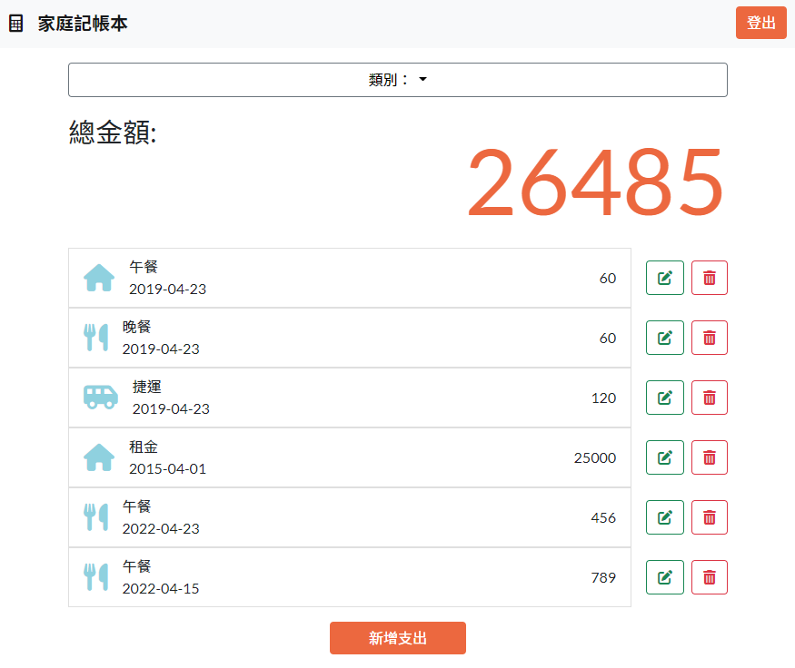

# 家庭記帳本
可以建立專屬自己的支出清單。

<br>

## 功能
- 使用者可以註冊帳號
- 登入後，使用者可以在首頁一次瀏覽所有支出
- 登入後，使用者可以在首頁看到所有支出清單的總金額
- 登入後，使用者可以新增、編輯、刪除支出
- 登入後，使用者可以根據類別篩選支出

### 環境設置
1. 安裝 node.js 與 npm
2. 將專案 clone 到本地
   ```
   https://github.com/HitomiHuang/expense-tracker.git
   ```

3. 安裝相關套件
   ```
      npm install
   ```

4. 安裝完畢，輸入以下指令，運行專案
   ```bash
   npm run start
   ```

5. 若出現此行網址代表運行順利
   ```bash
   App is running on http://localhost:3000
   ```
6. 建立種子資料(類別、假帳號、假支出)
   ```bash
   npm run seed
   ```
8. 測試種子資料

| Name | Email | Password |
| ------------- | :---: | -------- |
| user          | root@example.com| 12345678  |


### 開發工具
- Bootstrap 5.1.3
- Bcryptjs 2.4.3
- Connect-flash 0.1.1
- Dotenv 16.0.0 
- Express 4.17.3
- Express-Handlebars 6.0.4   
- Express-session 1.17.2  
- Font-awesome 6.x
- Method-override 3.0.0
- Mongoose 6.2.10
- Node.js 16.14.0
- Nodemon 2.0.15
- Passport 0.5.2
- Passport-local 1.0.0